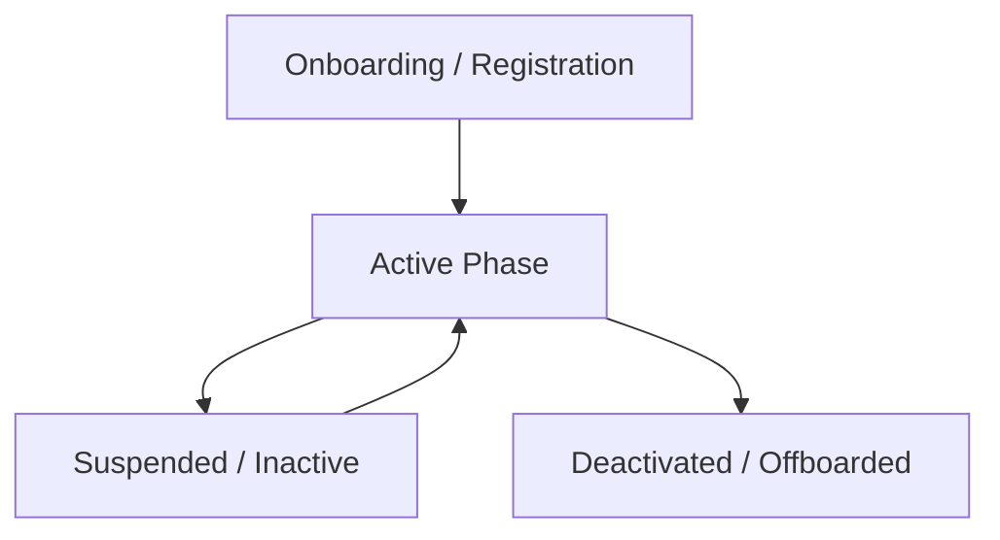

# Society Lifecycle

A society (Tenant) progresses through several phases on the platform:

## 1. Onboarding / Registration
- Super Admin inputs basic details (Society Name, Slug, Plan Type: Basic, Standard, Enterprise).
- Active module keys are provisioned into the `tenant_modules` registry table.
- A default `society_admin` profile is provisioned.

## 2. Active Phase
- Society Admin builds the property tree (Blocks, Buildings, Units).
- Residents are onboarded, billing cycles are run, security terminals activate.

## 3. Suspended / Inactive
- Occurs due to payment defaults or administrative locks.
- Logins are disabled, page routes display an "Account Inactive" barrier.

## 4. Deactivated / Offboarded
- Society metadata remains for audit history, but active states are set to `FALSE`.
